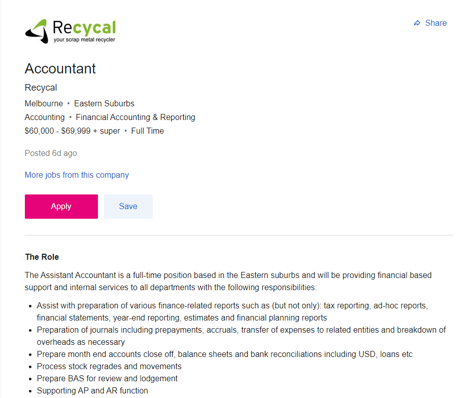
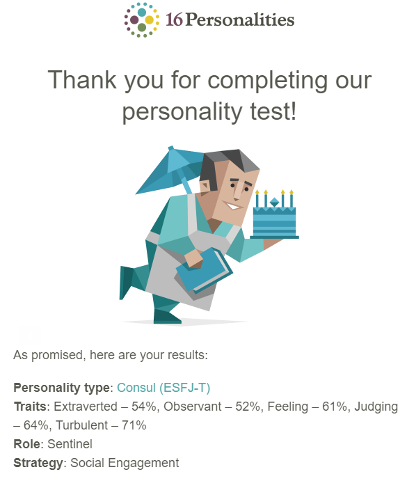
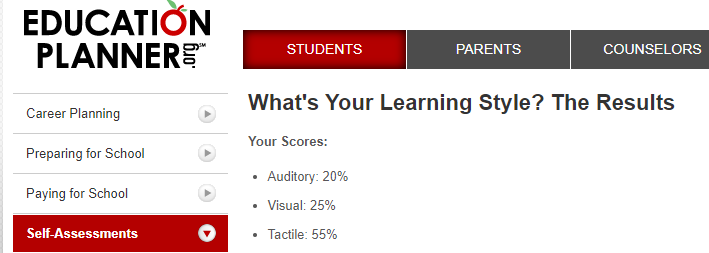
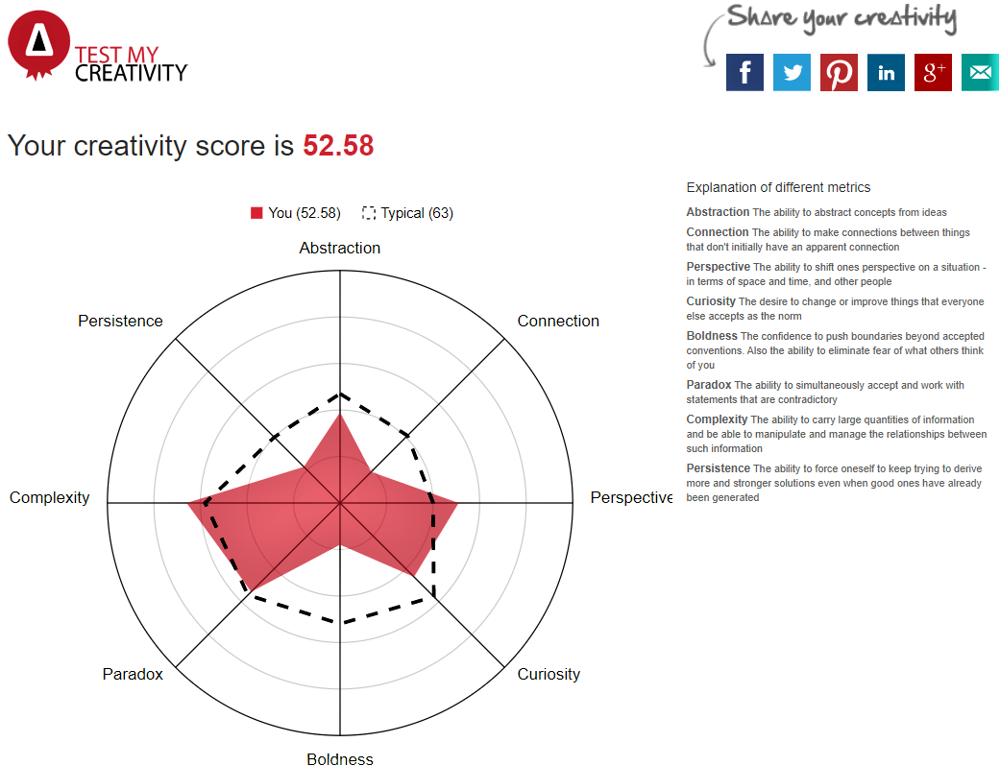

<html>
<title>Assingment 1</title>
<meta charset="UTF-8">
<meta name="viewport" content="width=device-width, initial-scale=1">
<link rel="stylesheet" href="https://www.w3schools.com/w3css/4/w3.css">
<link rel="stylesheet" href="https://fonts.googleapis.com/css?family=Raleway">

<body class="w3-light-grey">

<!-- w3-content defines a container for fixed size centered content,
and is wrapped around the whole page content, except for the footer in this example -->

<!-- Header -->
<header class="w3-container w3-center w3-padding-32">
  <h1><b>COSC1078 - Assingment 1</b></h1>
</header>

<!-- Grid -->

<!-- Blog entries -->

  <!-- project idea -->
  

    

  <header class="w3-container w3-center w3-padding-32">
    <h1><b>My Profile</b></h1>
  </header>
  

  

  

  

  

  

  <!-- Blog entry -->
  

    

      <h3><b>Intereset in IT</b></h3>
      <h4>What is your interest in IT? When did your interest in IT start? Was there a particular event of person that sparked your interest? Outline your It Experience. </h4>
    

    

      
My first interest in IT sparked in high school where I choose to do IT as an elective in year 9/10 and then further studied it throughout the rest of my high school years. However, my first interest when it came to computers was by my brother when I was around 9 years old where he got me hooked on PC video games (the game that he hooked me one was World of Warcraft’s second expansion Burning Crusade) from then on, I became a PC gamer. So, with my interest in computers sparking from a young age I was very interest and eager in IT studies, now my favourite part of IT includes Cybersecurity and database systems which also links into my major of accounting.

      

    <h4>Why did you choose to come to RMIT?</h4>
    
Honestly, the choice of what university to study at was a close tie between RMIT and Swinburne as Swinburne offered a course which includes a double degree of Accounting and IT. However, the reason for choosing RMIT was due to location, as well as I believed the accounting bachelor at RMIT university has better tools to educate me and make more qualified, as coming out of high school the ATAR entry was much larger than any other university as well they offered a work placement for the course, allowing me to get real-life industry knowledge and skills before graduating.

        

        

        

        

      

    

  

  

  <!-- Ideal Job -->
  

    

      <h3><b>Ideal Job</b></h3>
    

    

      
This Job as a financial recording and reporting accountant is most appealing to me as it allows me to look at transactions and record them into accounts and reports for me to analyse. It is appealing as I enjoy working on computers and software’s to create accurate reports as it involves to much calculating and reporting and there is no better feeling in the world then finishing an accurate report for me. I also love the calculating/recording part as it is somewhat difficult and requires a lot of time and attention to detail.

      
The skills required to do a job like this in my opinion are to have proper qualifications (completion of accounting bachelor or maybe some other relevant business bachelor to have the basic theory and knowledge) as well as good computer skills as accountants will need to know how to use many software’s and be aware of computer macros which will make creating the reports much more efficient. Another key skill I believe is the ability to work both autonomously and as a team, accountants tend to work alone while in the recording and reporting stage however it does also require a team effort in having the same idea with co-workers on how to help a client based on these reports.

      
As of now, I do not have much actual work experience, however I have completed assignments that are real-life simulations which allowed me to learn some fundamentals of an accounting software called Xero. I also have a lot of Microsoft software experience especially in Excel which is vital to accountants.The best way for me to obtain my skills is obviously working in the real life industry which I will be doing next year, however until then I can watch YouTube tutorial videos on accounting software’s that I’m not familiar with and try and practise them in my own time so I can get used to navigating and effectively using the software’s.

The job link: <a href="url">https://www.seek.com.au/job/53275088?type=promoted#searchRequestToken=5279005b-45cd-4266-a4c0-7898c8aa3864</a>

      

        

        

        

        

      

    

  

  <!-- Quiz -->
    

      

        <h3><b>Quiz 1 and 2 results</b></h3>
      

      

        <
        <
      

    

<!-- project idea -->

  

<header class="w3-container w3-center w3-padding-32">
  <h1><b>Project Idea</b></h1>
</header>

<!-- overview -->

  

    <h3><b>Overview</b></h3>
    
My project idea is similar to a budgeting/finance assistance software where businesses or individuals can input their financial data to help them calculate their profits and then give advice to them to improve their financials as well as tips on proper budgeting and saving money. For Businesses, they would need to input more financial data as they have much more transactions and other variables, as well the business side will include advice based on their ratios (Liquidity, profitability ratios etc). 

  

  

  

  

  

<!-- description -->

  

    <h3><b>Description</b></h3>
    
There would be many features to this service, the main one being giving feedback and statistics on the user’s financial figures. The way to get to the feedback and statistics however is firstly by the user inputting their accurate financial figures into the software (the more accurate they are the more the feedback will help improve them). Inputting the figures will allow the software to understand all variables of the users’ financials and be able to give direct feedback. This feature would also include (for businesses specifically) multiple financial ratios and give detailed explanations on how to improve these ratios (an example would be if inventory turnover is very long the business should incentivise their inventory by offering credit terms).  

    
The software would also include a budgeting feature, which would help users be more aware on their spending and save money by creating a savings goal for the future. The budget feature is like a spending plan that takes into account both current and future income and expenses, which is valuable long-term for users, as it will keep user spending in check and make sure their savings are on track for the future and help reach their savings goal. Budgeting also ensures users to not spend money they don’t have and helps avoid poor financial decisions as the budget will allow the user to know exactly how much they earn and how much they can spend per month/week. 

    
These two features are different as the budgeting feature is to help users long-term and forecast their future transactions whereas the feedback one is based on previous years data and giving direct feedback to help users instantly on reasons why they are making or losing a certain amount. The feedback software is more business orientated as well whereas the budget is more for both individual and business users. When thinking about these software’s and how much they should cost to user’s, I would set the budgeting feature to be free (as I believe budgeting is a need for everyone) and the feedback feature to be a premium feature and cost a small amount. The purpose of these features is to help improve financial stability, but also to help educate the users on the importance of proper financing and improve their overall financial knowledge. 

  

  

  

  

  

<!-- skills required -->

  

    <h3><b>Outcome</b></h3>
    
If the project is successful, the outcome would be a cheap, easy to use accounting software that would help all users improve their financial stability and assist them into creating a budget plan and allowing them to reach their financial goals. Some problems that may be solved would be correct coding which can be solved by educating myself on coding with the many resources online and the project not being user friendly which can be solved by testing the software and some individuals and get feedback off them before publishing the project. The impact this software would have is large, as it will be an educational and practical tool for users in order to improve their financial situation. 

  

  

  

  

  

<!-- END BLOG ENTRIES -->

<!-- Introduction menu -->

  <!-- About Card -->
  

  
    

      <h4><b>Personal Information</b></h4>
      
My name is Riley McKay, I’m a second year RMIT University student studying a Bachelor of Accountancy (Professional) and I am expecting to graduate the year ending 2023 as I will be interning at an accounting firm for my RMIT co-op placement in 2022. Some personal background knowledge about is that I am a Maltese Australian (my fathers’ side of the family is of Maltese heritage) and can only speak English and a very little amount of French after studying it in high school. My favourite hobby to do is watch and play basketball with my friends as well as playing video games with them.

    

  

  <!-- Personal Profile -->
  

    

      <h4><b>Personal Profile</b></h4>
      <h4>What do the results of these tests mean for you?</h4>
      
After completing the quizzes and looking at the results I’m not to surprised. I’ve always known that I would be a tactile learner as the way I learn always requires me to be hands on (whether writing calculations etc.). The creativity test was also not a surprise as I do believe I have a bigger complexity and perspective metric then the other metrics. However, the test I was surprised on was the 16 personalities test, where it said I’m 54% extraverted. I assumed I’d be a little more extraverted with a ratio of around 60-65% extravert and 40-35% introvert. These results have reassured me on my personality and learning traits and have told me that I’m a littler more extraverted then introverted.

      <h4>How do you think these results may influence your behaviour in a team?</h4>
      
 I don’t think these results will influence a change in my behaviour as a team, as all of them are more team friendly. Having a Tactile, slightly extraverted, and observant traits are the perfect traits for a member of a team; however, I don’t believe these traits are suitable for leader position. With this being said, I want to become more extraverted and slightly less observant so my personality can shift into more of a leader position of the team rather than just a member. 

      <h4> How should you take this into account when forming a team? </h4>
      
 I should definitely find a more direct, extraverted, and bolder person when trying to form a team as they would be ideal for the leader role of a team. With that being said, I would also like a couple more people similar to my traits to fill the rest of the team which I believe would create an ideal, healthy functioning and effective team. 

    

  

<!-- Quiz 3 Result -->
  

    

      <h3><b>Quiz 3 result</b></h3>
    

    

      <
      

      

<!-- Motivation -->

  

    <h3><b>Motivation</b></h3>
  

  

    
My motivation for this project idea is obviously my passion for Accounting and Business, and I believe that it would be very useful and helpful for individuals especially for those who have limited expertise on this topic and how to improve their financials. Also, the market for this project idea is literally ever individual and business as accounting is needed aspect for survivability and stability. I want the project to be user friendly (easy to use etc) and as well cheap and convenient (mobile app) so it would be appealable for individuals and businesses so they can use this software to greatly improve their financials. 

    

    

<!-- Tools and Technologies -->

  

    <h3><b>Tools and Technologies</b></h3>
  

  

    
The main hardware required would be a well-working computer as well as an external hard drive to ensure all software information and data is backed up onto it to have a secure archive for software information as well as to prevent data loss in case of a system crash or internal computer hard drive failure.  

    
The main software required would be a html coding software (GitHub and Atom). This will assist in creating and designing the accounting software by inputting html codes into GitHub and Atom which will allow for the creation and design of the accounting software.   

    

    

<!-- Outcome -->

  

    <h3><b>Skills Required</b></h3>
  

  

    
The main skill required for this project is having high html coding knowledge. Html coding is the biggest part of my project idea, as all of the accounting features, user interaction and even the creation of the software must be coded. It is very feasible to find the skills required to code the accounting software, as not only am I learning html in class I’m also experimenting codes on basic templates to improve my overall knowledge on html coding. There are also many  resources online to assist in improving my html coding knowledge. Finding the software and hardware are also very feasible, as the external hard drive may cost a bit, but the html coding software’s are free and easy to download. 

    

    

<!-- END Introduction Menu -->

<!-- END GRID -->

 

<!-- END w3-content -->

<!-- Footer -->
<footer class="w3-container w3-dark-grey w3-padding-32 w3-margin-top">
  
Riley McKay, Email: s3839145@student.rmit.edu.au

</footer>

</body>
</html>
